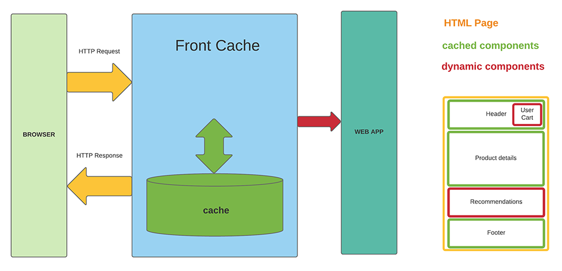
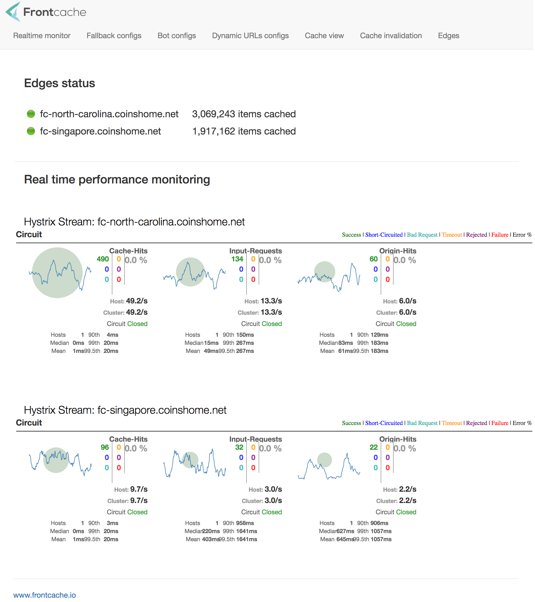

## Frontcache - utility to increase Web App performance.

### [it's page fragment cache + remote includes + concurrent execution]

#### Features

* Boost server response time for dynamic pages 

* Reduce backend load dozen times! 
   
* Increase application's resilience

* Can be used with web apps written in any language

==

==

### Frontcache console - realtime stats
==

==

Frontcache developed & tested with Java based Web apps but can be used with other languages/technologies as well. 

### Technical details - [check Wiki](https://github.com/eternita/frontcache/wiki "check Wiki")
