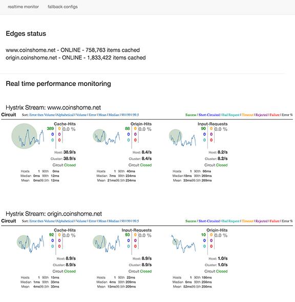

## FrontCache - utility to increase Web App performance.

### [it's page fragment cache + remote includes + concurrent execution]

It's developed & tested with Java based Web apps but can be used with other languages/technologies as well. 

### Features

1. Allows to cache parts of dynamic pages.

2. Faster execution even for pure dynamic pages.
   Standard MVC approach runs backend routines in serial mode.
   FrontCache execute page components / fragments in cun concurrent mode what can speed up server response time in multiple times.
   
3. Much more storage efficient caching. 
   Standard caching of whole pages cache a lot of duplicated content (e.g. footer and header for every page).
   FrontCache utilizes component caching what allows to avoid caching duplicates. 

### Frontcache console - watch your cache realtime
==

==

### Technical details - check wiki
