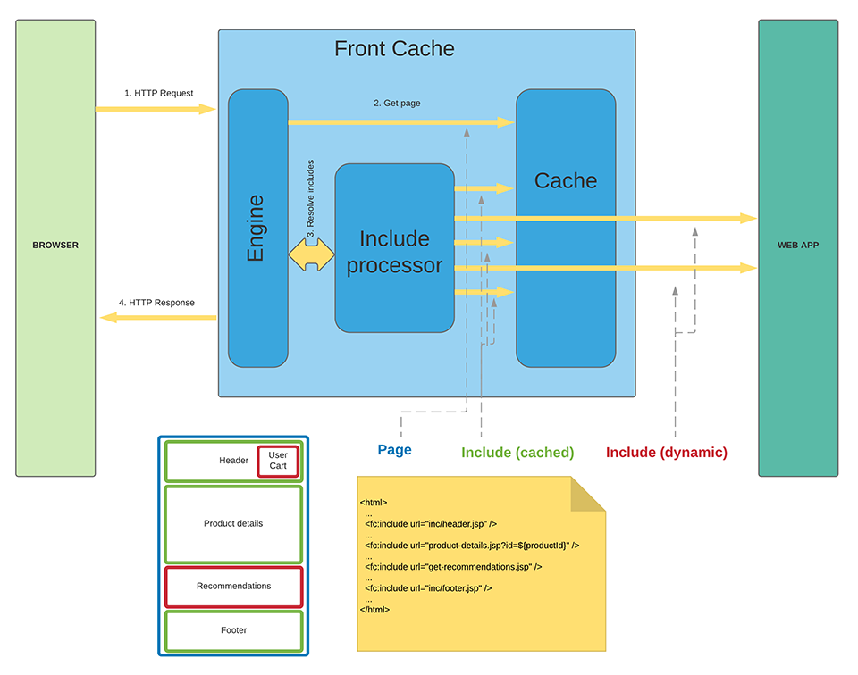

## Frontcache = [includes + fragment cache] x edge side


- Licensing: https://www.eternita.co/frontcache.html

#### Get started

|                       |                                                                                                                |
|-----------------------|----------------------------------------------------------------------------------------------------------------|
| **See the payoff**    | [Value proposition](docs/value.md) — measured A/B on 100k real requests                             |
| **Understand it**     | [Concepts](docs/concept.md) — fragment caching, request lifecycle, ...                              |
| **Install it**        | [Install guide](docs/install-guide.md) — library, archive, installer script, or container                      |
| **Choose a topology** | [Deployment use cases](docs/deployment-usecases.md) — filter, standalone proxy, or multi-region                |
| **See it work**       | [Java / Spring Boot](examples/frontcache-spring) · [PHP](examples/frontcache-php) — each runs with one command |
| **Read more**         | [Documentation index](docs/doc-index.md)         |

Quickest look, if you have Docker:

```sh
docker run -d --name frontcache -p 8080:9080 \
  -e ORIGIN_HOST=your-origin.example.com \
  pavlikovskiy/frontcache-server:2.8.0
```


#### Features

* Reduce server response time for dynamic pages 

* Reduce backend load dozen times! 
   
* Increase application's resilience

* Can be used with web apps written in any language





