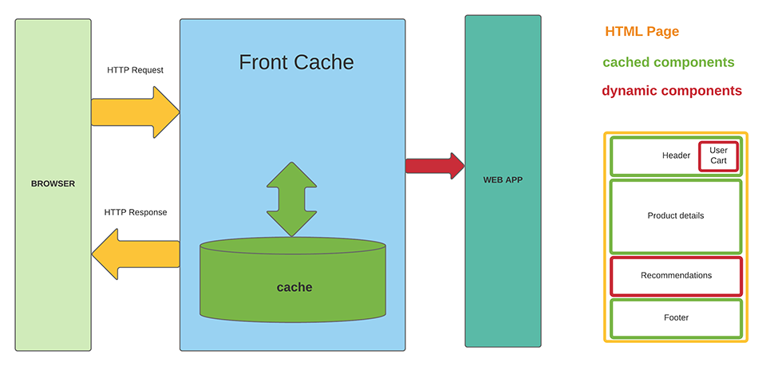
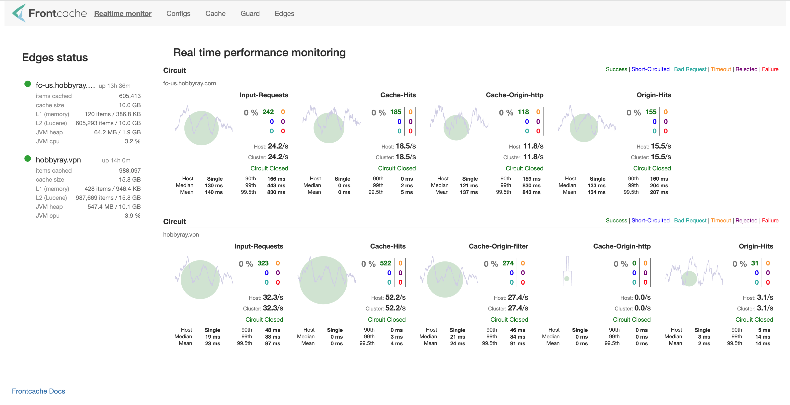

## Frontcache - utility to increase Web App performance.

### [it's page fragment cache + remote includes + concurrent execution]

- Licensing: https://www.eternita.co/frontcache-license.html

#### Get started

| | |
| --- | --- |
| **Install it** | [Install guide](docs/HOWTO-install.md) — library, archive, installer script, or container |
| **Choose a topology** | [Deployment use cases](docs/HOWTO-deployment-usecases.md) — filter, standalone proxy, or multi-region |
| **See it work** | [JSP](examples/frontcache-jsp) · [Spring Boot](examples/frontcache-spring) · [PHP](examples/frontcache-php) — each runs with one command |
| **Protect a node** | [Guard rules](docs/frontcache-guard-getting-started.md) |

Quickest look, if you have Docker:

```sh
docker run -d --name frontcache -p 8080:80 \
  -e ORIGIN_HOST=your-origin.example.com \
  pavlikovskiy/frontcache-server:2.5.0
```


#### Features

* Reduce server response time for dynamic pages 

* Reduce backend load dozen times! 
   
* Increase application's resilience

* Can be used with web apps written in any language





### Frontcache console - realtime stats




Frontcache developed & tested with Java based Web apps but can be used with other languages/technologies as well. 


