# Frontcache — Deployment How-To & Use-Case Spec

> Detailed how-to guide and diagrams for the three primary deployment topologies of
> [Frontcache](https://github.com/eternita/frontcache/wiki).
>
> Frontcache is a reverse-proxy / web-filter page-fragment cache. It serves cached page
> fragments, stitches together `<fc:include url="..."/>` fragments (optionally concurrently),
> serves bots differently from users, and provides circuit-breaking / fallbacks via Hystrix.

All class names, properties, headers, ports, and tag syntax below are taken from the actual
repo (paths cited inline) so the snippets are copy-paste accurate.

---

## 0. Concepts you need before any topology

### 0.1 The two entry modes

| Mode | Entry class | Role | Runs where |
|------|-------------|------|------------|
| **Filter** | `org.frontcache.FrontCacheFilter` | Servlet filter inside the app's container | Same JVM as the Java web app |
| **Standalone** | `org.frontcache.FrontCacheServlet` | Reverse proxy to a configured origin host | Separate host/process (in front of any-language app) |

Both delegate to the singleton **`FrontCacheEngine`**, which orchestrates three pluggable
subsystems (see [CLAUDE.md](../CLAUDE.md) / `frontcache-core`):

1. **CacheProcessor** — `front-cache.cache-processor.impl`; default `L1L2CacheProcessor`
   (L1 = Ehcache in-memory, L2 = Lucene on-disk index under `FRONTCACHE_HOME/cache/`).
2. **IncludeProcessor** — resolves `<fc:include/>`; default `ConcurrentIncludeProcessor` (parallel).
3. **Hystrix wrappers + Fallback resolver** — circuit-break each origin call, serve fallback content on 5XX/open circuit.

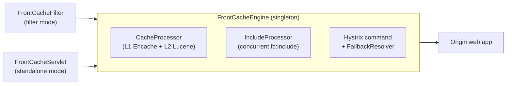

<!-- SVG fallback (renders outside GitHub) -->
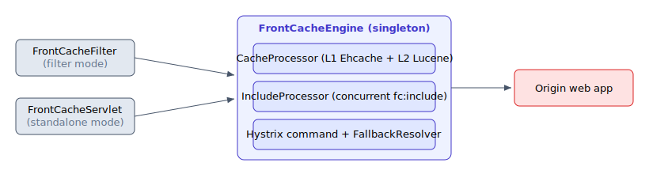

### 0.2 Request lifecycle (applies to every topology)

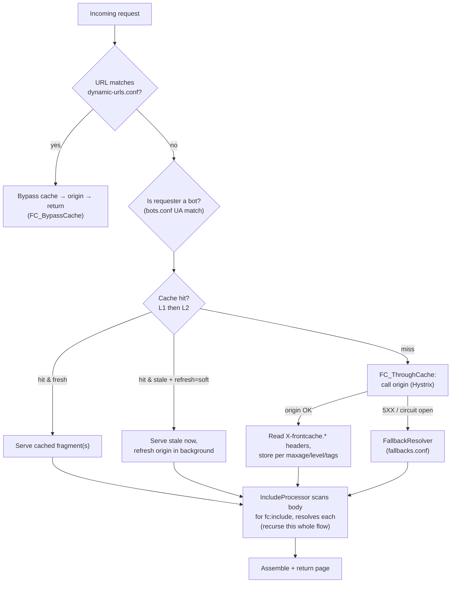

<!-- SVG fallback (renders outside GitHub) -->
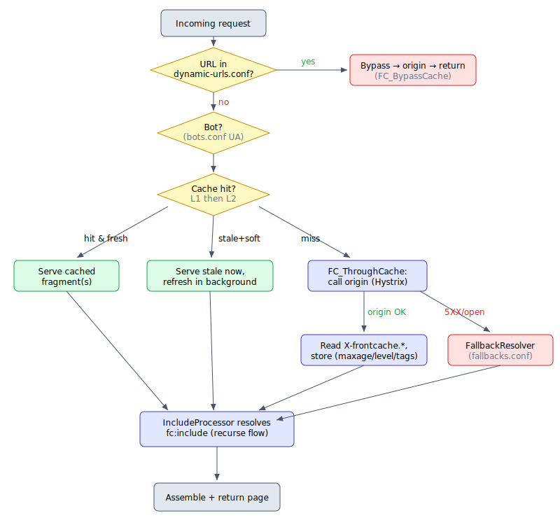

### 0.3 How the origin tells Frontcache what to cache

The **origin app** controls caching via response headers (or JSP tags that emit them).
Source: `frontcache-core/.../core/FCHeaders.java`, taglib `META-INF/fc.tld`.

**Response headers the origin sets:**

| Header | Meaning | Example |
|--------|---------|---------|
| `X-frontcache.component.maxage` | TTL. `0`=no cache (default), `-1`/`forever`=forever, or `60`/`15m`/`24h`. Supports `bot:`/`browser:` prefixes | `24h`, `bot:30d` |
| `X-frontcache.component.tags` | Pipe-separated invalidation tags | `product\|catalog` |
| `X-frontcache.component.refresh` | `regular` (default) or `soft` (serve-stale-while-revalidate) | `soft` |
| `X-frontcache.component.cache-level` | `L1` or `L2` (default L2) | `L1` |

**JSP tag equivalents** (taglib `http://frontcache.org/core`, prefix `fc`):

```jsp
<%@ taglib uri="http://frontcache.org/core" prefix="fc" %>

<fc:component maxage="1h" tags="catalog|product" refresh="soft" level="L2" />

<fc:include url="/common/header.jsp" />
<fc:include url="/common/recommendations" call="async" />
<fc:include url="/seo/footer" client="bot" />
```

### 0.4 Standard ports (from `build.gradle` Gretty config)

| Component | HTTP | HTTPS |
|-----------|------|-------|
| Standalone server (`frontcache-server`) | 9080 | 9443 |
| Console UI (`frontcache-console`) | 7080 | 7443 |
| Webfilter test app (`frontcache-tests`) | 8080 | 8443 |

Management/admin API is served at `/frontcache-io` (`FrontCacheIOServlet`).

---

## 1. Use case #1 — Frontcache as a servlet filter inside a Java web app

**When to use:** you own a Java/servlet web app, want fragment caching + includes + fallbacks
**without** standing up a separate proxy tier. Frontcache runs in the same JVM/WAR.

### 1.1 Topology

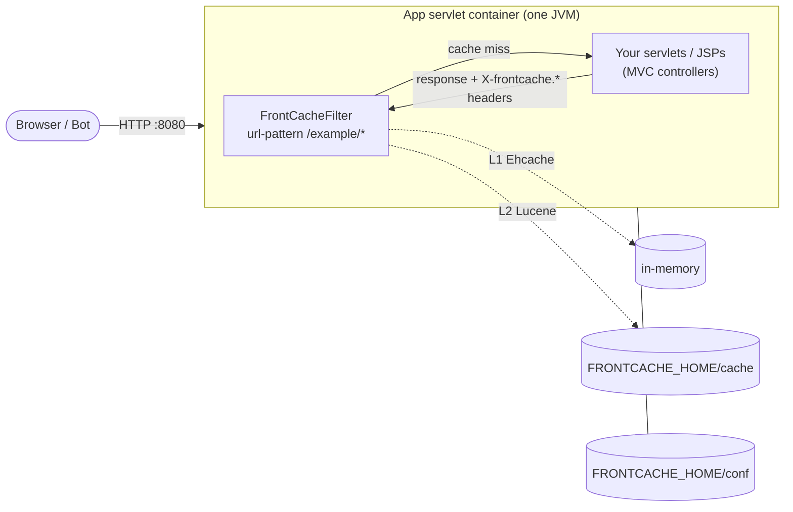

<!-- SVG fallback (renders outside GitHub) -->
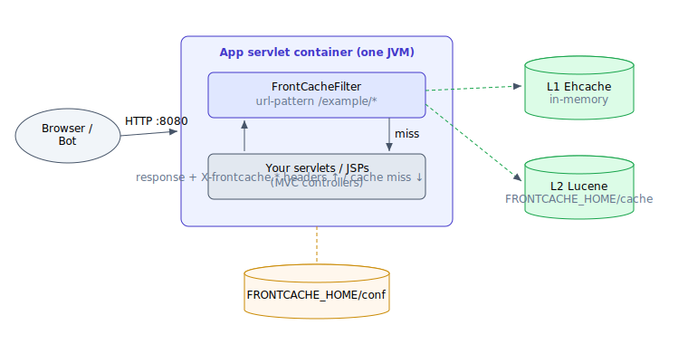

There is no separate origin host — the "origin" is the same app, reached by the filter
passing the request down the filter chain.

### 1.2 How-to steps

1. **Add the dependency.** Put `frontcache-core` on the app's classpath
   (`./gradlew :frontcache-core:build` → jar, or `publishToMavenLocal`).

2. **Register the filter** in `WEB-INF/web.xml`
   (see `examples/frontcache-jsp/src/main/webapp/WEB-INF/web.xml`):

   ```xml
   <filter>
       <description>Front Cache Filter</description>
       <filter-name>FrontCacheFilter</filter-name>
       <filter-class>org.frontcache.FrontCacheFilter</filter-class>
   </filter>
   <filter-mapping>
       <filter-name>FrontCacheFilter</filter-name>
       <url-pattern>/example/*</url-pattern>
   </filter-mapping>
   ```

   Scope the `url-pattern` to the cacheable surface; leave admin/login/POST paths out (or list
   them in `dynamic-urls.conf`).

3. **Provision `FRONTCACHE_HOME`.** Copy a `FRONTCACHE_HOME/conf` skeleton (model it on
   `frontcache-tests/FRONTCACHE_HOME_FILTER/conf`). In **filter mode you do NOT set an
   origin host** — the app itself is the origin. Minimal `frontcache.properties`:

   ```properties
   front-cache.cache-processor.impl=org.frontcache.cache.impl.L1L2CacheProcessor
   front-cache.include-processor.impl=org.frontcache.include.impl.ConcurrentIncludeProcessor
   front-cache.include-processor.impl.concurrent.thread-amount=8
   front-cache.include-processor.impl.concurrent.timeout=5000
   front-cache.fallback-resolver.impl=org.frontcache.hystrix.fr.FileBasedFallbackResolver
   front-cache.default-domain=myapp.com
   front-cache.site-key=CHANGE_ME
   ```

   Provide the rest of the `conf/` files: `bots.conf`, `dynamic-urls.conf`, `fallbacks.conf`,
   `fc-l1-ehcache-config.xml`, `hystrix.properties`, `fc-logback.xml`.

4. **Pass JVM system properties** when launching the container:

   ```sh
   -Dfrontcache.home=/path/to/FRONTCACHE_HOME \
   -Dlogback.configurationFile=/path/to/FRONTCACHE_HOME/conf/fc-logback.xml
   ```

   (Or set the `FRONTCACHE_HOME` env var.)

5. **Annotate cacheability in your views.** Add `<fc:component .../>` to JSPs (or emit the
   `X-frontcache.component.*` headers from controllers) and break pages into
   `<fc:include url=".../>` fragments so hot static parts cache while personalized parts stay
   dynamic.

6. **Wire invalidation from app code.** On a content change, call the in-core
   `FrontCacheClient`, or POST to the IO API (next section). Tag-based invalidation uses the
   `tags` you set on each component.

### 1.3 Verify

Hit a `/example/*` URL twice; second response should carry Frontcache trace headers
(`X-frontcache.id`, and with `front-cache.log-to-headers=true`, timing headers). The e2e
harness for this mode is `frontcache-tests` (`./tests.sh`).

---

## 2. Use case #2 — Frontcache standalone, in front of an any-language web app

**When to use:** your app is PHP/Python/Node/Ruby/etc., or you want cache isolated on its own
host/tier. Frontcache runs as a reverse proxy (`FrontCacheServlet`) and forwards misses to a
configured origin.

### 2.1 Topology

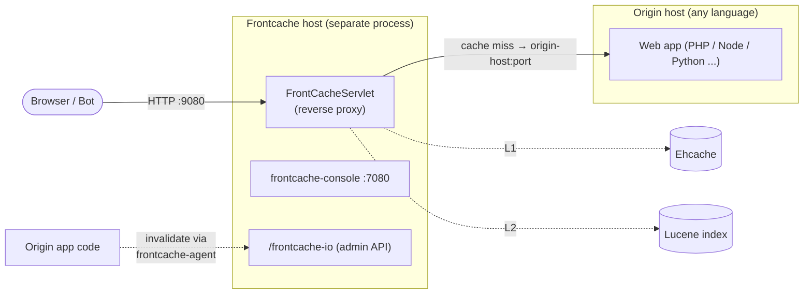

<!-- SVG fallback (renders outside GitHub) -->
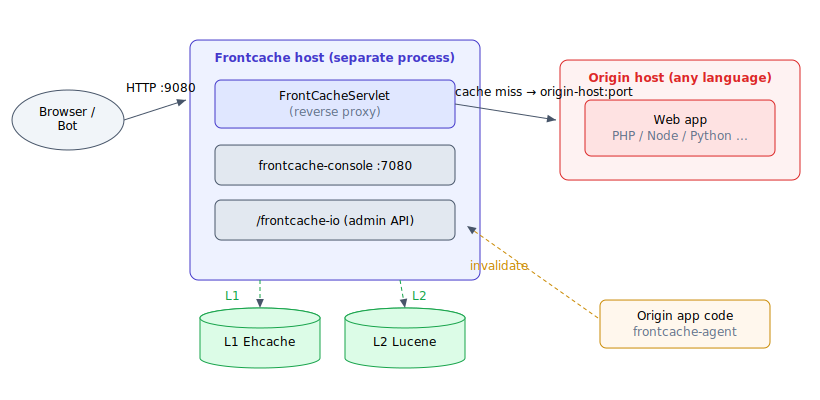

### 2.2 How-to steps

1. **Get the standalone server.** Build `frontcache-server` (`./gradlew :frontcache-server:build`,
   produces `ROOT.war` + standalone Jetty), or download binaries and run `./bin/frontcache`.
   It listens on **:9080** (HTTP) / **:9443** (HTTPS).

   > To provision a fresh AWS EC2 host (Ubuntu 24.04, in any region) from scratch — AMI,
   > key pair, and a security group opening 22/80/443 — see
   > [`create-frontcache-aws-ec2-instance.sh`](../create-frontcache-aws-ec2-instance.sh).
   > To then deploy to a remote Ubuntu host as a `systemd` service, see
   > [`install-frontcache-server-remote.sh`](../install-frontcache-server-remote.sh). For a
   > worked example — including the real-world gotchas (privileged ports 80/443, Java-8 bytecode
   > for Jetty 9.3.6's annotation scanner, macOS AppleDouble files breaking config parsing, AWS
   > Security Group rules) — see the debugging log
   > [`docs/log-frontcache-standalone-deployment.md`](log-frontcache-standalone-deployment.md).

2. **Point it at your origin** in `$FRONTCACHE_HOME/conf/frontcache.properties`:

   ```properties
   front-cache.http-port=9080
   front-cache.https-port=9443

   front-cache.origin-host=app.internal.example.com
   front-cache.origin-http-port=8080
   front-cache.origin-https-port=8443

   front-cache.cache-processor.impl=org.frontcache.cache.impl.L1L2CacheProcessor
   front-cache.include-processor.impl=org.frontcache.include.impl.ConcurrentIncludeProcessor
   front-cache.fallback-resolver.impl=org.frontcache.hystrix.fr.FileBasedFallbackResolver
   front-cache.default-domain=www.example.com
   front-cache.site-key=CHANGE_ME
   ```

   **Multi-domain** on one Frontcache (dots → underscores in the property key):

   ```properties
   front-cache.domains=fc1-test.org,fc2-test.org
   front-cache.domain.fc1-test_org.origin-host=origin.fc1-test.org
   front-cache.domain.fc1-test_org.origin-http-port=8080
   front-cache.domain.fc1-test_org.origin-https-port=8443
   ```

3. **Configure behavior in `conf/`:**
   - `bots.conf` — UA keywords treated as bots (per domain) → enables `client="bot"` / `bot:` TTL splits.
   - `dynamic-urls.conf` — regex of never-cache URLs (carts, login, admin) → routed via `FC_BypassCache`.
   - `fallbacks.conf` — `URI_PATTERN | fallback_file | optional_origin_request`; served when origin 5XX or circuit open. Files seed at startup.
   - `fc-l1-ehcache-config.xml`, `hystrix.properties` — L1 sizing and circuit-breaker thresholds.

4. **Launch with system properties:**

   ```sh
   -Dfrontcache.home=/path/to/FRONTCACHE_HOME \
   -Dlogback.configurationFile=/path/to/FRONTCACHE_HOME/conf/fc-logback.xml
   ```

5. **Make the origin emit cache directives.** Since the app isn't Java, set the response
   headers directly from whatever framework you use:

   ```
   X-frontcache.component.maxage: 1h
   X-frontcache.component.tags: catalog|product-42
   X-frontcache.component.refresh: soft
   ```

   And embed fragment markers in HTML the origin returns:

   ```html
   <fc:include url="/store/product-details-${productId}"/>
   ```

6. **Switch DNS / load balancer** so public traffic hits Frontcache :9080 instead of the
   origin directly. Keep the origin reachable only from Frontcache.

7. **Invalidate from app code** using `frontcache-agent` (minimal httpclient-only jar):

   ```java
   FrontCacheAgent agent = new FrontCacheAgent("http://fc-host:9080");
   agent.removeFromCache(siteKey, "/store/product-details-42.*"); // regexp filter
   ```

   Or call the IO API directly (see §4).

### 2.3 Request flow (standalone)

```mermaid
sequenceDiagram
    participant C as Client
    participant FC as FrontCacheServlet
    participant O as Origin (any lang)
    C->>FC: GET /store/product/42
    alt cache hit (fresh)
        FC-->>C: cached page (assembled)
    else miss / stale
        FC->>O: GET /store/product/42 (Hystrix FC_ThroughCache)
        alt origin 200
            O-->>FC: HTML + X-frontcache.* headers
            FC->>FC: store per maxage/tags/level<br/>resolve fc:include (concurrent)
            FC-->>C: assembled page
        else origin 5XX / circuit open
            FC->>FC: FallbackResolver (fallbacks.conf)
            FC-->>C: fallback content (X-frontcache.fallback-is-used)
        end
    end
```

<!-- SVG fallback (renders outside GitHub) -->
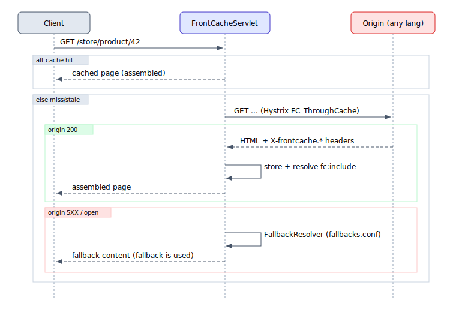

---

## 3. Use case #3 — GSLB → N standalone Frontcaches (multi-region) → Java app with Frontcache filter

**When to use:** global, multi-region edge caching with an authoritative Java origin that
*also* caches. Two cache tiers: regional edge (standalone) + origin-local (filter). GSLB
(global server load balancing, e.g. geo-DNS / anycast) routes each user to the nearest edge.

### 3.1 Topology

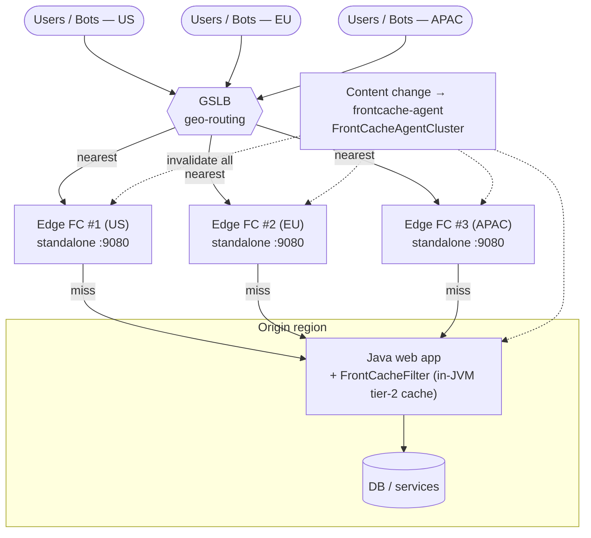

<!-- SVG fallback (renders outside GitHub) -->
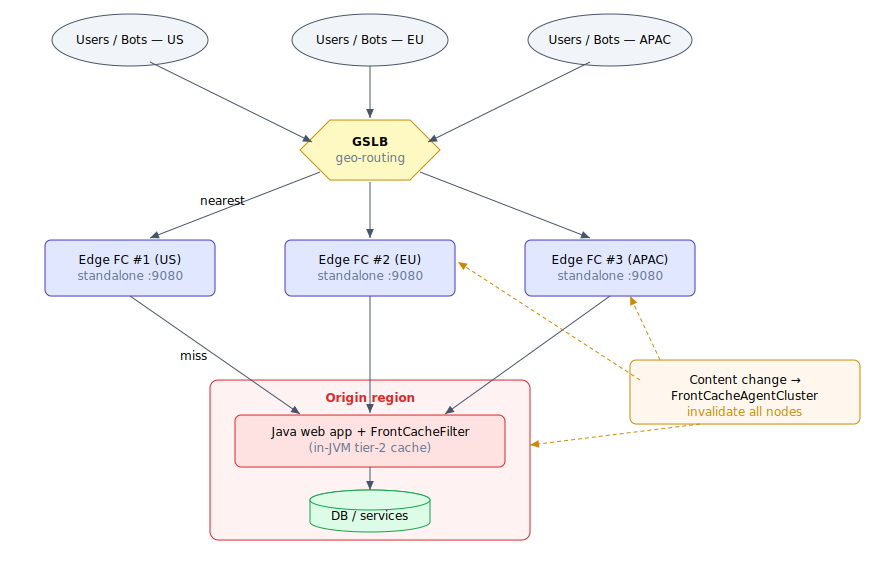

Two caching tiers:
- **Tier 1 (edge, standalone):** absorbs the bulk of traffic close to users; lowest latency.
- **Tier 2 (origin filter):** shields the Java app's controllers/DB from edge misses (and from N edges all missing at once).

### 3.2 How-to steps

1. **Build the origin tier (Use case #1).** Java app with `FrontCacheFilter`, its own
   `FRONTCACHE_HOME`. This is the single authoritative origin all edges forward to.

2. **Deploy N standalone edges (Use case #2)**, one per region. Each edge's
   `front-cache.origin-host` points at the **origin region's public/anycast hostname** (the
   Java app tier). Give each edge a distinct identity so traces are attributable:

   ```properties
   front-cache.host-name=edge-eu-1
   front-cache.origin-host=origin.example.com
   front-cache.origin-https-port=443
   front-cache.site-key=SHARED_SITE_KEY   # same key across the cluster
   ```

   Keep `site-key` (and `domains`) consistent across the cluster so cluster invalidation and
   multi-domain routing line up everywhere.

3. **Put a GSLB in front of the edges.** Configure geo/latency routing + health checks
   against each edge's `:9080` (or a health URL). GSLB returns the nearest healthy edge IP.

4. **Tune the two tiers differently.**
   - Edges: longer TTLs for static/SEO fragments; honor `bot:`/`browser:` splits at the edge
     so crawlers get long-lived SEO HTML while users get fresher content.
   - Origin filter: shorter TTLs / `refresh=soft` so it revalidates against the DB but still
     shields it from stampedes when several edges miss together.

5. **Cluster-wide invalidation** with `FrontCacheAgentCluster` (from `frontcache-agent`):

   ```java
   FrontCacheAgentCluster cluster = new FrontCacheAgentCluster(
       "http://edge-us-1:9080",
       "http://edge-eu-1:9080",
       "http://edge-apac-1:9080",
       "http://origin:9080");          // include the origin filter node
   cluster.removeFromCache(siteKey, "/store/product/42.*");
   ```

   This fans the `invalidate` action (with `X-frontcache.site-key`) to every node so a content
   change clears all tiers in all regions. Tag-based invalidation (`X-frontcache.component.tags`)
   lets one product update clear every fragment carrying that tag.

### 3.3 Multi-region request + invalidation flow

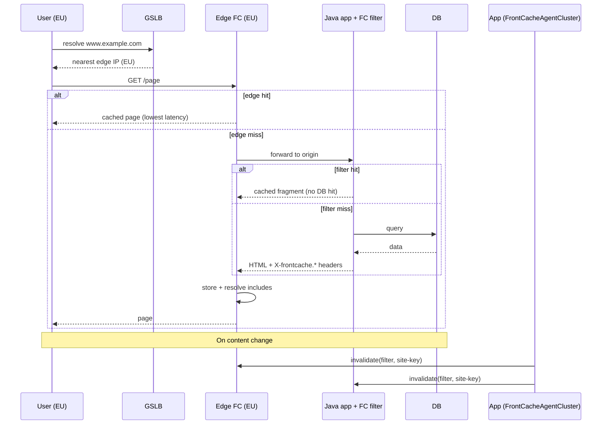

<!-- SVG fallback (renders outside GitHub) -->
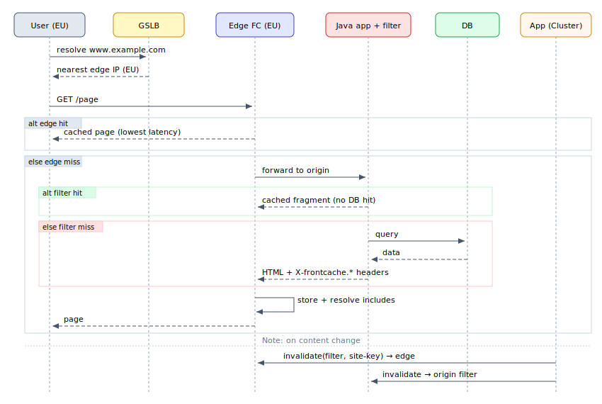

---

## 4. Cache management / invalidation API (all topologies)

Served by `FrontCacheIOServlet` at **`/frontcache-io`**; `action=<name>` query param. Used by
`frontcache-agent` and `frontcache-console`. Restrict it to an internal port via
`front-cache.management.port`.

| Action | Purpose | Key params |
|--------|---------|-----------|
| `invalidate` | Evict cache entries matching a regexp | `filter` (regexp), `X-frontcache.site-key` header |
| `get-cache-state` | Cache processor type + item count | — |
| `get-cached-keys` | Stream all cached URLs | — |
| `get-from-cache` | Fetch one cached entry | `key` |
| `dump-keys` | Export keys to `FRONTCACHE_HOME/warmer/` | — |
| `reload` | Reload engine + all config | — |
| `reload-fallbacks` | Reload `fallbacks.conf` | — |
| `get-fallback-configs` | List fallback configs | — |
| `get-bots` | List bot UA keywords | — |
| `get-dynamic-urls` | List never-cache patterns | — |
| `patch` | Background cache-patching job | — |

---

## 5. Choosing a topology

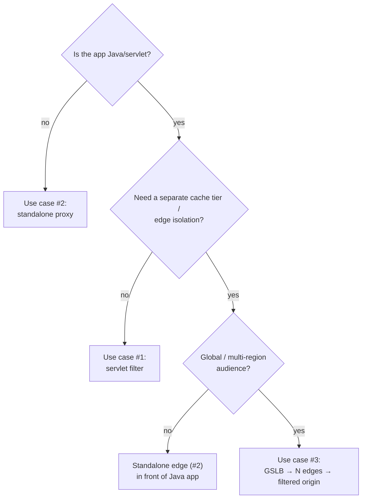

<!-- SVG fallback (renders outside GitHub) -->
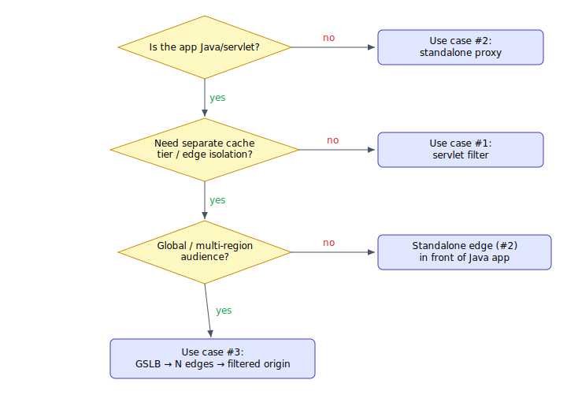

| | #1 Filter | #2 Standalone | #3 GSLB multi-region |
|---|---|---|---|
| Origin language | Java only | Any | Any (Java origin recommended for tier-2) |
| Extra hosts | none | 1 proxy tier | N edges + origin |
| Latency to user | app-local | proxy-local | region-local (best) |
| Origin/DB protection | 1 tier | 1 tier | 2 tiers |
| Invalidation | `FrontCacheClient` / IO API | `FrontCacheAgent` | `FrontCacheAgentCluster` |
| Complexity | low | medium | high |

---

### References (repo)
- Filter / Servlet entry: `frontcache-core/.../org/frontcache/{FrontCacheFilter,FrontCacheServlet}.java`
- Headers: `frontcache-core/.../core/FCHeaders.java`
- Taglib: `frontcache-core/src/main/resources/META-INF/fc.tld`
- IO API actions: `frontcache-core/.../io/FrontcacheAction.java`
- Sample props: `frontcache-core/src/main/resources/front-cache.template.properties`, `frontcache-tests/FRONTCACHE_HOME_FILTER/conf/`
- Agent: `frontcache-agent/.../agent/{FrontCacheAgent,FrontCacheAgentCluster}.java`
- web.xml example: `examples/frontcache-jsp/src/main/webapp/WEB-INF/web.xml`
- Ports: `build.gradle` (Gretty configs)
- Create EC2 host (any region): `create-frontcache-aws-ec2-instance.sh`
- Remote install script: `install-frontcache-server-remote.sh`
- Standalone deployment debugging log: [`docs/log-frontcache-standalone-deployment.md`](log-frontcache-standalone-deployment.md)
- Wiki: https://github.com/eternita/frontcache/wiki
