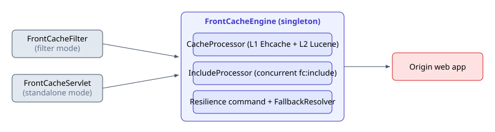
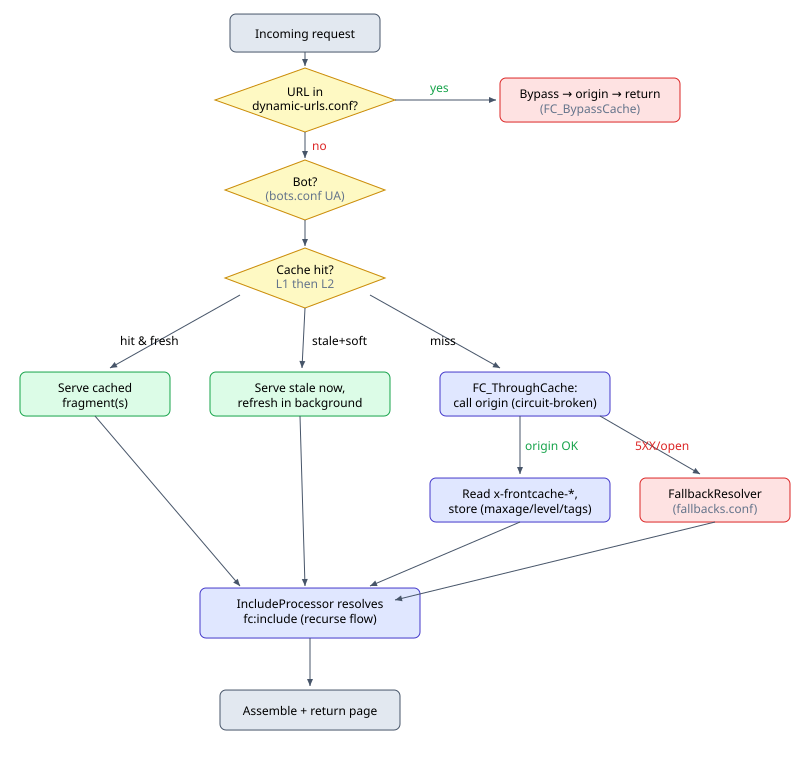

# Frontcache — Concepts


## 1. What Frontcache is

Frontcache is a **page-fragment cache** that sits in the request path — either as a reverse
proxy or as a servlet filter. It:

- caches *fragments* of a page rather than whole pages, so a personalized page can still be
  mostly cached;
- stitches fragments together, resolving `<fc:include url="..."/>` markers (by default
  concurrently);
- serves bots differently from browsers, so crawlers can get long-lived SEO HTML while users get
  fresher content;
- circuit-breaks each origin call and serves fallback content (uri pattern based) when the origin
  fails.

It is language-agnostic on the origin side: anything that can set a response header can drive it.

## 2. The two entry modes

| Mode |  Role | Runs where |
|------|------|------------|
| **Filter** | Servlet filter inside the app's container | Same JVM as the Java web app |
| **Standalone** | Reverse proxy to a configured origin host | Separate host/process (in front of any-language app) |

The difference is only how the request arrives and how the "origin" is reached — in filter mode
the origin is the rest of the filter chain, in standalone mode it is
`front-cache.origin-host`. Everything after that point is identical, which is why features like
guard rules and the header contract behave the same in both.

## 3. Inside the engine

Both entry modes delegate to the singleton **`FrontCacheEngine`**, which orchestrates three
pluggable subsystems, all implemented in `frontcache-core`:

1. **CacheProcessor** — `front-cache.cache-processor.impl`; default `L1L2CacheProcessor`
   (L1 = Ehcache in-memory, L2 = Lucene on-disk index under `FRONTCACHE_HOME/cache/`).
2. **IncludeProcessor** — resolves `<fc:include/>`; default `ConcurrentIncludeProcessor` (parallel).
3. **Resilience commands + Fallback resolver** — circuit-break each origin call, serve fallback content on 5XX/open circuit.



Each subsystem is swappable by class name in `frontcache.properties`; the defaults above are what
every example and every install channel ships with.

## 4. Request lifecycle

Applies to every topology, and recurses for each `fc:include` in the assembled page.


The resilience command names in that flow (`FC_Total`, `FC_ThroughCache*`, `FC_BypassCache`), their
group keys and their isolation strategies are covered in
[resilience-command-flow.md](resilience-command-flow.md).

## 5. The origin is in charge of caching

Frontcache caches **nothing** until the origin says so. That is the central idea: cacheability is
a property of the response, declared by the application that knows what the response means, not a
rule list maintained in the cache.

Source: `frontcache-core/.../core/FCHeaders.java`, taglib `META-INF/fc.tld`.

**Response headers the origin sets:**

| Header | Meaning | Example |
|--------|---------|---------|
| `x-frontcache-component-maxage` | TTL. `0`=no cache (default), `-1`/`forever`=forever, or `60`/`15m`/`24h`. Supports `bot:`/`browser:` prefixes | `24h`, `bot:30d` |
| `x-frontcache-component-tags` | Pipe-separated invalidation tags | `product\|catalog` |
| `x-frontcache-component-refresh` | `regular` (default) or `soft` (serve-stale-while-revalidate) | `soft` |
| `x-frontcache-component-cache-level` | `L1` or `L2` (default L2) | `L1` |

Because the default is `0`, an origin that sets nothing gets a pure pass-through — a safe starting
state, and the first thing to check when "nothing is being cached".

**JSP tag equivalents** (taglib `http://frontcache.org/core`, prefix `fc`):

```jsp
<%@ taglib uri="http://frontcache.org/core" prefix="fc" %>

<fc:component maxage="1h" tags="catalog|product" refresh="soft" level="L2" />

<fc:include url="/common/header.jsp" />
<fc:include url="/common/recommendations" call="async" />
<fc:include url="/seo/footer" client="bot" />
```

Non-Java origins emit the headers directly and write the `<fc:include url="..."/>` markers into
the HTML they return; there is no other difference.

## 6. Fragments and includes

A page is a composition. The origin returns an outer document containing
`<fc:include url="..."/>` markers, and the IncludeProcessor fetches each included URL through the
whole lifecycle above — so every fragment has its own TTL, tags, cache level and bot/browser
split, and a cache miss on one fragment does not cost the others.

| Attribute | Values | Effect |
|---|---|---|
| `url` | required | the fragment to resolve (relative to the same origin) |
| `call` | `sync` (default), `async` | `sync` fragments are fetched in parallel and waited for, and their content goes into the page. `async` is fire-and-forget: the call is made but nothing is waited for and **nothing is inserted** — for counters and pings that must not slow a page served from cache |
| `client` | `bot`, `browser` | include the fragment only for that client class (per `bots.conf`); for the other class the marker is replaced with an empty string |

`sync` includes that time out (`front-cache.include-processor.impl.concurrent.timeout`) fall back
through the `FallbackResolver`, so one slow fragment degrades rather than failing the page;
`async` includes get no fallback, since nothing was being waited for.

This is what makes a personalized page cacheable: the cart badge stays dynamic
(`maxage=0` or a `dynamic-urls.conf` entry) while the header, nav, footer and product body cache
for hours.

## 7. Configuration lives in `FRONTCACHE_HOME`

Not in the application's own config. The directory is located via `-Dfrontcache.home=…` or the
`FRONTCACHE_HOME` environment variable, with
`-Dlogback.configurationFile=…/conf/fc-logback.xml` alongside it.

| `conf/` file | Owns |
|---|---|
| `frontcache.properties` | subsystem impls, origin host/ports, domains, site key, ports |
| `bots.conf` | UA keywords treated as bots (per domain) → `client="bot"` / `bot:` TTL splits |
| `dynamic-urls.conf` | regex of never-cache URLs (carts, login, admin) → routed via `FC_BypassCache` |
| `fallbacks.conf` | `URI_PATTERN \| fallback_file \| optional_origin_request`; served when the origin 5XXs or the circuit is open. Files seed at startup |
| `guard-rules.conf` | request-rejection rules — see [guard-getting-started.md](guard-getting-started.md) |
| `fc-l1-ehcache-config.xml` | L1 sizing |
| `resilience.properties` | circuit-breaker thresholds and pool sizes |
| `fc-logback.xml` | logging |
| `frontcache.id` | this node's id, kept in its own file so a deployment can stamp it per host; it is what `x-frontcache-id` reports |

Alongside `conf/`, the same home holds `cache/` (the L2 Lucene index) and `logs/`.

Two ready-made filter-mode skeletons live in this repository:
[the JSP example's](../examples/frontcache-jsp/FRONTCACHE_HOME) and
[the Spring example's](../examples/frontcache-spring/FRONTCACHE_HOME).

## 8. Standard ports

The embedded-Jetty launcher defaults:

| Component | HTTP | HTTPS |
|-----------|------|-------|
| Standalone server (`frontcache-server`) | 9080 | 9443 |
| Console UI (`frontcache-console`) | 7080 | 7443 |

> **The recurring trap:** `front-cache.http-port` / `front-cache.https-port` are the
> **client-facing** ports — 80/443 when something terminates TLS in front of Frontcache — not the
> port Frontcache listens on. They drive redirect rewriting, so getting them wrong sends users to
> `:9080`. See [examples/front-door](../examples/front-door) for the nginx case.

## 9. Invalidation and management

Two ways an entry leaves the cache: its `maxage` expires, or something invalidates it.

Invalidation is by **regexp over URLs** or by **tag** — the `x-frontcache-component-tags` value a
fragment was stored with — so one product update can clear every fragment carrying
`product-42`, across every page that includes it.

It is requested through the management API at **`/frontcache-io`**
(`FrontCacheIOServlet`, `action=<name>`), guarded by the `x-frontcache-site-key` header and
restricted to `front-cache.management.port`. Java callers can use `frontcache-agent`
(`FrontCacheAgent`, and `FrontCacheAgentCluster` to fan an invalidation across a multi-region
cluster); everyone else uses plain HTTP. The full action table is in
[deployment-usecases.md](deployment-usecases.md) §4.

## 10. Observability

With `front-cache.log-to-headers=true`, responses carry `x-frontcache-trace-request.*` headers
saying per fragment whether it was `from-cache`, `dynamic`, or `error` — the fastest way to see
whether the header contract is being honoured. `x-frontcache-id` identifies the node that served
the response, and `x-frontcache-fallback-is-used` marks a fallback.

`FRONTCACHE_HOME/logs/` holds four logs — `frontcache-requests.log` (one line per
request/fragment), `error.log`, `fallback.log`, and `frontcache-failed-requests.log` (guard-rule
rejections and circuit-breaker fallbacks). The [log-analytics example](../examples/log-analytics) indexes
all four into Elasticsearch + Kibana with ready-made dashboards.

---

### Where to go next

- Pick a topology — filter, standalone proxy, or GSLB multi-region:
  [deployment-usecases.md](deployment-usecases.md)
- Install it: [install-guide.md](install-guide.md)
- Reject bad traffic at the edge: [guard-getting-started.md](guard-getting-started.md)
- Circuit breakers in detail: [resilience-command-flow.md](resilience-command-flow.md)
- Run something: [JSP](../examples/frontcache-jsp) · [Spring Boot](../examples/frontcache-spring) · [PHP](../examples/frontcache-php)

---

Topologies: [deployment-usecases.md](deployment-usecases.md) ·
Install: [install-guide.md](install-guide.md) ·
Licensing: <https://www.eternita.co/frontcache.html>
