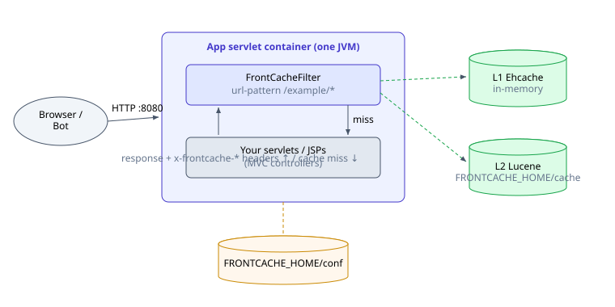
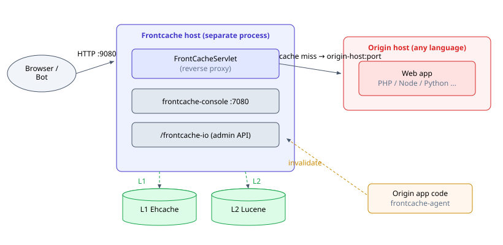
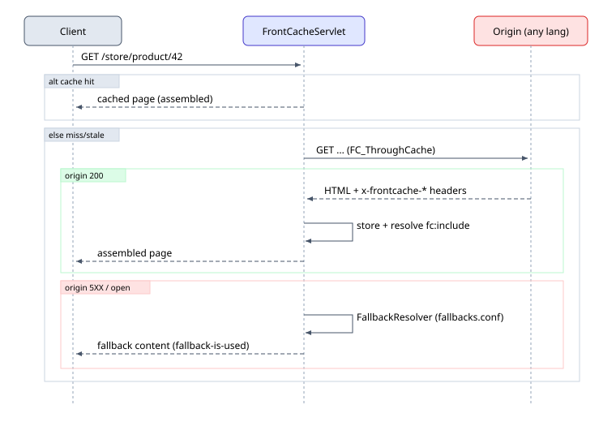
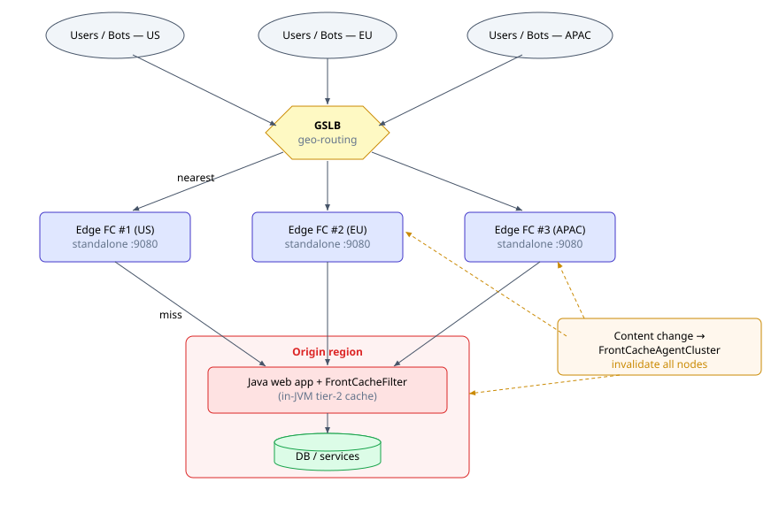
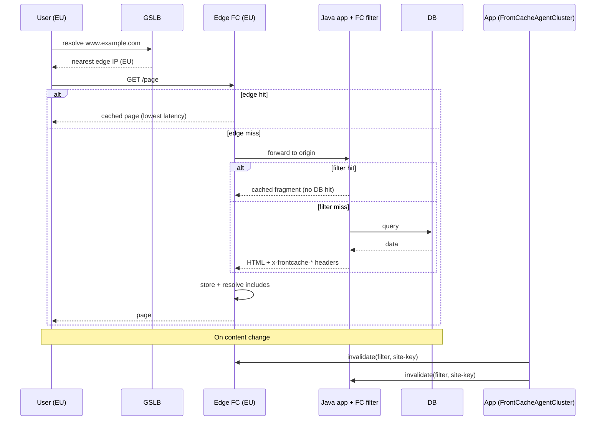
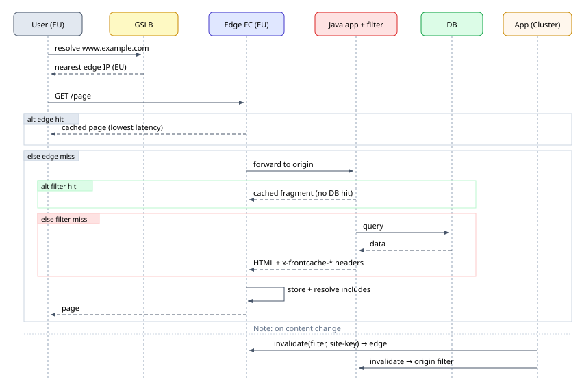

# Frontcache — Deployment How-To & Use-Case Spec

Concepts: [concept.md](concept.md)
Every topology below is the same engine wired differently.

---

## 1. Use case #1 — Frontcache as a servlet filter inside a Java web app

**When to use:** you own a Java/servlet web app, want fragment caching + includes + fallbacks
**without** standing up a separate proxy tier. Frontcache runs in the same JVM/WAR.

### 1.1 Topology



There is no separate origin host — the "origin" is the same app, reached by the filter
passing the request down the filter chain.

### 1.2 How-to steps

1. **Add the dependency.** Put the published `org.frontcache:frontcache-core` on the app's
   classpath — channel A of the [install guide](install-guide.md) has the Gradle and Maven
   snippets, including the repository to add.

2. **Register the filter** in `WEB-INF/web.xml` (see
   [the JSP example's `web.xml`](../examples/frontcache-jsp/src/main/webapp/WEB-INF/web.xml)):

   ```xml
   <filter>
       <description>Front Cache Filter</description>
       <filter-name>FrontCacheFilter</filter-name>
       <filter-class>org.frontcache.FrontCacheFilter</filter-class>
   </filter>
   <filter-mapping>
       <filter-name>FrontCacheFilter</filter-name>
       <url-pattern>/example/*</url-pattern>
   </filter-mapping>
   ```

   Scope the `url-pattern` to the cacheable surface; leave admin/login/POST paths out (or list
   them in `dynamic-urls.conf`).

3. **Provision `FRONTCACHE_HOME`.** Copy a `FRONTCACHE_HOME/conf` skeleton — unpack the
   published `frontcache-core-<version>-home.zip`, or start from the one in
   [the JSP example](../examples/frontcache-jsp/FRONTCACHE_HOME). In **filter mode you do NOT
   set an origin host** — the app itself is the origin. Minimal `frontcache.properties`:

   ```properties
   front-cache.cache-processor.impl=org.frontcache.cache.impl.L1L2CacheProcessor
   front-cache.include-processor.impl=org.frontcache.include.impl.ConcurrentIncludeProcessor
   front-cache.include-processor.impl.concurrent.thread-amount=8
   front-cache.include-processor.impl.concurrent.timeout=5000
   front-cache.fallback-resolver.impl=org.frontcache.hystrix.fr.FileBasedFallbackResolver
   front-cache.default-domain=myapp.com
   front-cache.site-key=CHANGE_ME
   ```

   Provide the rest of the `conf/` files — `bots.conf`, `dynamic-urls.conf`, `fallbacks.conf`,
   `fc-l1-ehcache-config.xml`, `hystrix.properties`, `fc-logback.xml`; what each one does is in
   [concept §7](concept.md#7-configuration-lives-in-frontcache_home).

4. **Pass JVM system properties** when launching the container:

   ```sh
   -Dfrontcache.home=/path/to/FRONTCACHE_HOME \
   -Dlogback.configurationFile=/path/to/FRONTCACHE_HOME/conf/fc-logback.xml
   ```

   (Or set the `FRONTCACHE_HOME` env var.)

5. **Annotate cacheability in your views.** Add `<fc:component .../>` to JSPs (or emit the
   `x-frontcache-component-*` headers from controllers) and break pages into
   `<fc:include url=".../>` fragments so hot static parts cache while personalized parts stay
   dynamic.

6. **Wire invalidation from app code.** On a content change, call the in-core
   `FrontCacheClient`, or POST to the IO API (next section). Tag-based invalidation uses the
   `tags` you set on each component.

### 1.3 Verify

Hit a `/example/*` URL twice; second response should carry Frontcache trace headers
(`x-frontcache-id`, and with `front-cache.log-to-headers=true`, timing headers). 

---

## 2. Use case #2 — Frontcache standalone, in front of an any-language web app

**When to use:** your app is PHP/Python/Node/Ruby/etc., or you want cache isolated on its own
host/tier. Frontcache runs as a reverse proxy (`FrontCacheServlet`) and forwards misses to a
configured origin.

### 2.1 Topology



### 2.2 How-to steps

1. **Get the standalone server.** Download and unpack the `frontcache-server` archive and run
   `./bin/frontcache` — channel B of the [install guide](install-guide.md), or channel D there
   for the container image. It listens on **:9080** (HTTP) / **:9443** (HTTPS).

   > To install it on a Linux host as a `systemd` service, use the published installer script —
   > channel C of the [install guide](install-guide.md).

2. **Point it at your origin** in `$FRONTCACHE_HOME/conf/frontcache.properties`:

   ```properties
   front-cache.http-port=9080
   front-cache.https-port=9443

   front-cache.origin-host=app.internal.example.com
   front-cache.origin-http-port=8080
   front-cache.origin-https-port=8443

   front-cache.cache-processor.impl=org.frontcache.cache.impl.L1L2CacheProcessor
   front-cache.include-processor.impl=org.frontcache.include.impl.ConcurrentIncludeProcessor
   front-cache.fallback-resolver.impl=org.frontcache.hystrix.fr.FileBasedFallbackResolver
   front-cache.default-domain=www.example.com
   front-cache.site-key=CHANGE_ME
   ```

   **Multi-domain** on one Frontcache (dots → underscores in the property key):

   ```properties
   front-cache.domains=fc1-test.org,fc2-test.org
   front-cache.domain.fc1-test_org.origin-host=origin.fc1-test.org
   front-cache.domain.fc1-test_org.origin-http-port=8080
   front-cache.domain.fc1-test_org.origin-https-port=8443
   ```

3. **Configure behavior in `conf/`** — `bots.conf`, `dynamic-urls.conf`, `fallbacks.conf`,
   `fc-l1-ehcache-config.xml`, `hystrix.properties`; each file's job is in
   [concept §7](concept.md#7-configuration-lives-in-frontcache_home). For a proxy tier
   the two that matter most on day one are `dynamic-urls.conf` (keep carts/login/admin
   uncached) and `fallbacks.conf` (what users see when the origin is down).

4. **Launch with system properties:**

   ```sh
   -Dfrontcache.home=/path/to/FRONTCACHE_HOME \
   -Dlogback.configurationFile=/path/to/FRONTCACHE_HOME/conf/fc-logback.xml
   ```

5. **Make the origin emit cache directives.** Since the app isn't Java, set the response
   headers directly from whatever framework you use:

   ```
   x-frontcache-component-maxage: 1h
   x-frontcache-component-tags: catalog|product-42
   x-frontcache-component-refresh: soft
   ```

   And embed fragment markers in HTML the origin returns:

   ```html
   <fc:include url="/store/product-details-${productId}"/>
   ```

6. **Switch DNS / load balancer** so public traffic hits Frontcache :9080 instead of the
   origin directly. Keep the origin reachable only from Frontcache.

7. **Invalidate from app code** using `frontcache-agent` (minimal httpclient-only jar):

   ```java
   FrontCacheAgent agent = new FrontCacheAgent("http://fc-host:9080");
   agent.removeFromCache(siteKey, "/store/product-details-42.*"); // regexp filter
   ```

   Or call the IO API directly (see §4).

### 2.3 Request flow (standalone)



---

## 3. Use case #3 — GSLB → N standalone Frontcaches (multi-region) → Java app with Frontcache filter

**When to use:** global, multi-region edge caching with an authoritative Java origin that
*also* caches. Two cache tiers: regional edge (standalone) + origin-local (filter). GSLB
(global server load balancing, e.g. geo-DNS / anycast) routes each user to the nearest edge.

### 3.1 Topology



Two caching tiers:
- **Tier 1 (edge, standalone):** absorbs the bulk of traffic close to users; lowest latency.
- **Tier 2 (origin filter):** shields the Java app's controllers/DB from edge misses (and from N edges all missing at once).

### 3.2 How-to steps

1. **Build the origin tier (Use case #1).** Java app with `FrontCacheFilter`, its own
   `FRONTCACHE_HOME`. This is the single authoritative origin all edges forward to.

2. **Deploy N standalone edges (Use case #2)**, one per region. Each edge's
   `front-cache.origin-host` points at the **origin region's public/anycast hostname** (the
   Java app tier). Give each edge a distinct identity so traces are attributable:

   ```properties
   front-cache.host-name=edge-eu-1
   front-cache.origin-host=origin.example.com
   front-cache.origin-https-port=443
   front-cache.site-key=SHARED_SITE_KEY   # same key across the cluster
   ```

   Keep `site-key` (and `domains`) consistent across the cluster so cluster invalidation and
   multi-domain routing line up everywhere.

3. **Put a GSLB in front of the edges.** Configure geo/latency routing + health checks
   against each edge's `:9080` (or a health URL). GSLB returns the nearest healthy edge IP.

4. **Tune the two tiers differently.**
   - Edges: longer TTLs for static/SEO fragments; honor `bot:`/`browser:` splits at the edge
     so crawlers get long-lived SEO HTML while users get fresher content.
   - Origin filter: shorter TTLs / `refresh=soft` so it revalidates against the DB but still
     shields it from stampedes when several edges miss together.

5. **Cluster-wide invalidation** with `FrontCacheAgentCluster` (from `frontcache-agent`):

   ```java
   FrontCacheAgentCluster cluster = new FrontCacheAgentCluster(
       "http://edge-us-1:9080",
       "http://edge-eu-1:9080",
       "http://edge-apac-1:9080",
       "http://origin:9080");          // include the origin filter node
   cluster.removeFromCache(siteKey, "/store/product/42.*");
   ```

   This fans the `invalidate` action (with `x-frontcache-site-key`) to every node so a content
   change clears all tiers in all regions. Tag-based invalidation (`x-frontcache-component-tags`)
   lets one product update clear every fragment carrying that tag.

### 3.3 Multi-region request + invalidation flow





---

Concepts: [concept.md](concept.md) ·
Install: [install-guide.md](install-guide.md) ·
Licensing: <https://www.eternita.co/frontcache-license.html>
