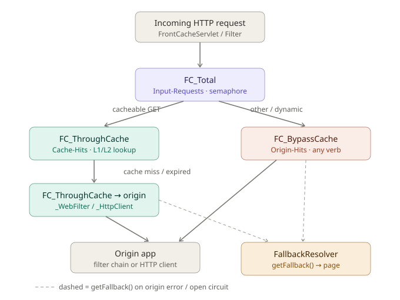

# HTTP request flow through resilience commands

How HTTP requests flow through the `FcCommand` wrappers in the
`org.frontcache.resilience` package. Every origin/cache touch is wrapped in a
command so it gets circuit-breaking, timeouts, and metrics.

As of 2.7 these run on **Resilience4j 2.x** — Netflix Hystrix is gone. The
command class names, the command keys, the property names and the dashboard wire
format are unchanged; see [Names that did not change](#names-that-did-not-change).

## Commands, in order

### `FC_Total`
The outer wrapper. `FrontCacheEngine.processRequest` runs every request through it.

- Group key = the request domain; command key = `Input-Requests`.
- Runs under a **semaphore** (`execution.isolation.strategy=SEMAPHORE`, a
  Resilience4j `Bulkhead` permit), so it executes on the caller thread, then
  delegates to `processRequestInternal`.
- `getFallback()` writes a fallback page.

### `FC_ThroughCache`
Only cacheable GETs reach it, via `CacheProcessorBase`.

- Group key = the request domain; command key = `Cache-Hits`; `run()` does the
  L1 (Ehcache) / L2 (Lucene) lookup.
- The domain comes from the `RequestContext`. For admin lookups via
  `FrontCacheIOServlet` the context is `null`, so the group key falls back to
  `front-cache.default-domain` (and to `FCConfig.DEFAULT_DOMAIN` if that is unset).
  (`getFromCache(url, context)` carries the context through from `processRequest`
  and the include processor.)
- Its `getFallback()` only logs and returns `null` — the only command that does
  **not** serve a fallback page.

### `FC_ThroughCache_WebFilter` / `FC_ThroughCache_HttpClient`
On a cache miss/expiry, `FCUtils.dynamicCall` picks one of these to fetch from origin. They carry distinct command keys so
their origin traffic shows up separately in the dashboard metrics stream.

- `FC_ThroughCache_WebFilter` — filter mode (`chain.doFilter` to the origin app
  in the same container). Command key `Cache-Origin-filter`.
- `FC_ThroughCache_HttpClient` — standalone mode (HTTP GET to the origin host).
  Command key `Cache-Origin-http`. Includes (`<fc:include>`) also reuse
  `_HttpClient` (via `includeDynamicCallHttpClient`).
- Both run on the shared `OriginHitsPool` thread pool.
- Both serve a `FallbackResolver` page on failure.

`Cache-Origin-http` and `Cache-Origin-filter` each get their own command config
in `resilience.properties` (THREAD isolation, 10000 ms timeout), and `OriginHitsPool`
its own `coreSize`.

### `FC_BypassCache`
Everything else (non-GET verbs, `dynamic-urls.conf` matches, dynamic requests)
skips the cache entirely, via `FrontCacheEngine`.

- Command key = `Origin-Hits`; forwards any verb to origin (filter chain or HTTP
  client). Runs on the shared `OriginHitsPool` thread pool.
- `getFallback()` writes a fallback page.

## Isolation: two paths

`execution.isolation.strategy` selects which one a command takes, and the two
behave differently on timeout.

- **Semaphore path** (`Input-Requests`, `Cache-Hits`) — a circuit breaker wrapping
  a `Bulkhead` permit, run inline on the request thread. `FC_Total` writes the
  servlet response from its fallback, so it has to stay on that thread. There is no
  `TimeLimiter` here and there cannot be: Resilience4j's takes a `Future`, and
  wrapping this path in one would move `FC_Total` off the request thread. The
  configured `execution.isolation.thread.timeoutInMilliseconds` for these two keys
  is therefore observed, not enforced: a watchdog sweeps the in-flight registry and
  logs a `WARN` naming the command, its budget and the elapsed time, plus a
  `rollingCountBudgetOverrunObserved` counter on the dashboard frame. It never aborts,
  never resolves a fallback, and never moves the failure rate — an overrun means
  "this succeeded, but late".
- **Thread path** (`Origin-Hits`, `Cache-Origin-http`, `Cache-Origin-filter`) — a
  circuit breaker wrapping a real `TimeLimiter` over a submit to `OriginHitsPool`.
  `interruptOnTimeout=true` maps to `cancelRunningFuture(true)`, which is still only
  an interrupt — which is why `FC_ThroughCache_HttpClient.getFallback()` also aborts
  the pending `HttpGet`: a blocking socket read ignores the interrupt flag, and
  without the abort the pooled connection is held for another full socket timeout.

`OriginHitsPool` is a plain `ThreadPoolExecutor` Frontcache owns, not a
Resilience4j `ThreadPoolBulkhead`: with `maxQueueSize=-1` it runs a
`SynchronousQueue`, so a submit with no free thread is rejected immediately rather
than queued. A queue in front of a slow origin would convert fast rejection (and a
fallback) into latency, which is the opposite of what the isolation is for.

Bulkhead and thread-pool rejections are excluded from the circuit breaker's error
percentage, so a busy node does not open its own circuits just because it is busy.

## Fallbacks
When a command's `run()` throws or its circuit is open, `FcCommand.execute()` calls
`getFallback()` — on the calling thread, from its own `catch` block — which asks
`FallbackResolverFactory` (default `FileBasedFallbackResolver`, configured in
`fallbacks.conf`) for a fallback page. `FC_Total`, `FC_BypassCache`, and both
`FC_ThroughCache_*` origin commands all serve fallbacks this way.
`FC_ThroughCache` (the cache lookup) is the exception — it returns `null`.

## Command key / group summary

| Command | Group key | Command key | Isolation | Timeout |
|---|---|---|---|---|
| `FC_Total` | request domain | `Input-Requests` | semaphore | 20000 ms (observed) |
| `FC_ThroughCache` | request domain (`front-cache.default-domain` if no context) | `Cache-Hits` | semaphore | 1500 ms (observed) |
| `FC_ThroughCache_WebFilter` | request domain | `Cache-Origin-filter` | `OriginHitsPool` | 10000 ms |
| `FC_ThroughCache_HttpClient` | request domain | `Cache-Origin-http` | `OriginHitsPool` | 10000 ms |
| `FC_BypassCache` | request domain | `Origin-Hits` | `OriginHitsPool` | 20000 ms |

One node serves one site, so there is exactly one group key at runtime. Commands,
metrics and breakers are keyed by command key alone; thread pools are node-level
resources.

## Names that did not change

Each of these is a wire or config contract read from outside the jar, so it was
kept when the package moved from `org.frontcache.hystrix` to
`org.frontcache.resilience`:

- **`GET /hystrix.stream`** — still served, indefinitely, alongside the current
  `GET /fc-dashboard.stream`. Reverse-proxy no-buffering rules and external
  Turbine point at it.
- **`hystrix.command.*` / `hystrix.threadpool.*` / `hystrix.config.stream.*`
  property keys** — accepted indefinitely alongside the `resilience.*` spelling, so
  existing tuning carries over untouched. Only the *file* name changed
  (`conf/hystrix.properties` → `conf/resilience.properties`); the old name is read
  for one more release, with a warning.
- **`"type":"HystrixCommand"` / `"type":"HystrixThreadPool"`** in the stream JSON —
  the type literals any Hystrix-compatible dashboard dispatches on.
- **`org.frontcache.hystrix.fr.*`** in `front-cache.fallback-resolver.impl` —
  remapped on load, with a warning.

Two upgrade traps worth knowing about: if you carry a `conf/fc-logback.xml` over
from 2.6 it still names the old fallback logger, which leaves `logs/fallback.log`
silently empty (the node warns once, with the exact edit); and if both
`hystrix.properties` and `resilience.properties` end up present, the new name wins —
the container and the installer both know about the rename and will not seed a
shipped default over your tuned file.
