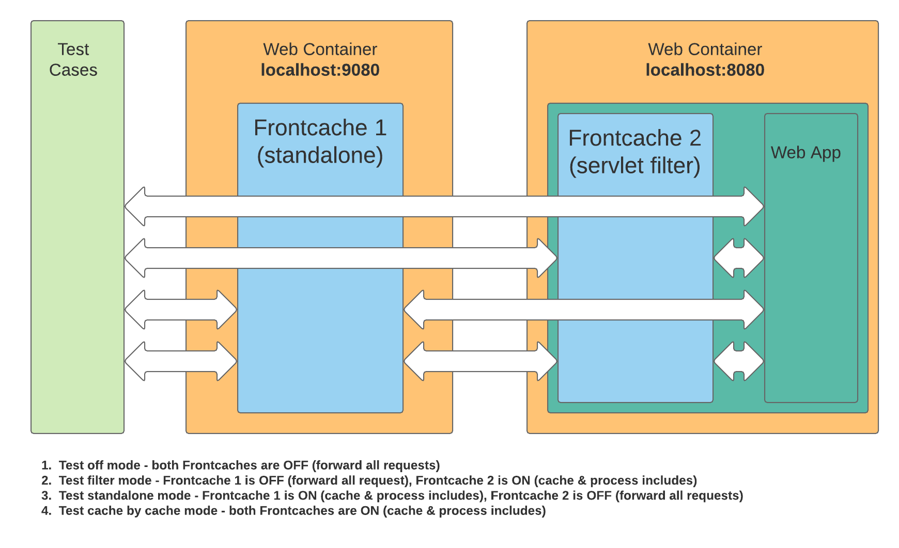

# frontcache-tests

End-to-end / integration test suite for Frontcache. It exercises the **same set of
behaviours twice** — once against Frontcache running as a **standalone reverse-proxy**
and once against Frontcache running as a **servlet filter** embedded in the origin app
— to guarantee both deployment modes behave identically.



```
Tests  →  FC standalone (:9080)  →  FC web filter (:8080)  →  Web app (:8080)
```

---

## 1. Topology & process model

| Component        | Port | Process                          | Frontcache mode | FRONTCACHE_HOME            |
|------------------|------|----------------------------------|-----------------|---------------------------|
| Test runner      | —    | Gradle `integrationTest` JVM     | n/a (client)    | n/a                       |
| FC standalone    | 9080 | embedded Jetty (`FrontcacheStandaloneServer`) — separate JVM | `FrontCacheServlet` (reverse proxy) | `FRONTCACHE_HOME_STANDALONE` |
| FC web filter    | 8080 | Gretty (`jetty9.4`)              | `FrontCacheFilter` | `FRONTCACHE_HOME_FILTER`  |
| Web app (origin) | 8080 | same Gretty JVM as the filter    | n/a (plain JSP/static app) | n/a              |
| Console          | 7080 | Gretty farm (optional)           | n/a             | n/a                       |

Key facts:

- The **filter and the web app share a single JVM** (Gretty farm) — the filter wraps the
  same webapp it caches. The standalone server runs in its **own JVM** and forwards *to*
  the :8080 container. Whether a request is actually cached at each hop depends on which
  of the two Frontcache instances is switched ON — see [§1.1 Test modes](#11-test-modes-the-2×2-onoff-matrix).
- The standalone server is launched as a `JavaExec` task
  (`standaloneFrontcacheJetty`) pointed at the webapp directory
  `src/test-integration/webapp` and serving on `:9080`.
- Both Frontcache instances use the default cache stack:
  `L1L2CacheProcessor` (Ehcache L1 + Lucene L2) and `ConcurrentIncludeProcessor`.
  `front-cache.log-to-headers=true` is set so tests can read trace info from response
  headers (see §6).

### 1.1 Test modes (the 2×2 ON/OFF matrix)

`img/tests2.png` presents four **conceptual** modes obtained by toggling each Frontcache
instance **ON** (cache the response & process `<fc:include>` markers) or **OFF** (forward
every request untouched). A request is served from the first ON cache it hits and never
reaches the layers behind it:

| # | Mode | FC1 standalone (:9080) | FC2 filter (:8080) |
|---|------|------------------------|--------------------|
| 1 | **off** | OFF (forward) | OFF (forward) |
| 2 | **filter** | OFF (forward) | ON (cache & includes) |
| 3 | **standalone** | ON (cache & includes) | OFF (forward) |
| 4 | **cache-by-cache** | ON (cache & includes) | ON (cache & includes) |

#### What the harness actually exercises

The current test setup does **not** realize all four modes. The FC2 filter is mapped to
`*` (`src/main/webapp/WEB-INF/web.xml`), so it is **always ON** for anything hitting
:8080, and the standalone server's origin (`origin.fc1-test.org:8080`, a loopback alias)
points straight at it. So FC2 can never be switched off in this harness, and only two
request paths exist:

| Suite | Request path | Effective mode |
|-------|--------------|----------------|
| **`Filter*Tests`** | client → `:8080` (FC2 filter, ON) → Web App | **2 — filter** (FC1 not in the path) |
| **`Standalone*Tests`** | client → `:9080` (FC1, ON) → `origin.fc1-test.org:8080` (FC2 filter, ON) → Web App | **4 — cache-by-cache** (FC1 chained in front of FC2) |

Consequences:

- **Cache-by-cache (mode 4) is covered by every `Standalone*Tests` suite** — a standalone
  request traverses *both* caches. There is no separate "cache-by-cache" suite.
- **Modes 1 (both off) and 3 (standalone-only, FC2 off) are not exercised** as drawn —
  they would require the FC2 filter to forward instead of cache, which the `*` mapping
  and the standalone origin routing prevent.

---

## 2. Source layout

```
frontcache-tests/
├── README.md                          ← this spec
├── img/tests2.png                     ← topology diagram
├── FRONTCACHE_HOME_STANDALONE/        ← runtime config + cache + logs for the :9080 server
│   └── conf/{frontcache.properties, bots.conf, dynamic-urls.conf, fallbacks.conf,
│            fc-l1-ehcache-config.xml, hystrix.properties, fc-logback.xml, frontcache.id, ...}
├── FRONTCACHE_HOME_FILTER/            ← runtime config + cache + logs for the :8080 filter
│   └── conf/...                        (same structure as STANDALONE)
└── src/
    ├── main/
    │   ├── java/org/frontcache/tests/
    │   │   ├── TestConfig.java                 ← base URLs, test domains
    │   │   ├── FrontcacheStandaloneServer.java ← embedded-Jetty launcher for :9080
    │   │   └── base/                           ← ABSTRACT test catalog (mode-agnostic)
    │   │       ├── TestsBase.java              ← shared setup/teardown, HtmlUnit client
    │   │       ├── SiteKeys.java               ← per-domain site keys
    │   │       ├── TestUtils.java              ← trace-header helpers
    │   │       ├── CommonTests.java
    │   │       ├── IncludeTests.java
    │   │       ├── ClientTests.java
    │   │       ├── AgentTests.java
    │   │       ├── FallbackHystrixTests.java
    │   │       ├── StaticReadTests.java
    │   │       ├── InvalidationTagsTests.java
    │   │       └── HTTPResponseCodeTests.java
    │   └── webapp/                             ← the ORIGIN web app (filter mode)
    │       ├── WEB-INF/{web.xml, tld/fc.tld}
    │       └── common/…, standalone/…          ← JSP & static fixtures
    └── test-integration/
        ├── java/org/frontcache/tests/
        │   ├── filter/Filter*Tests.java        ← concrete subclasses → :8080
        │   └── standalone/Standalone*Tests.java ← concrete subclasses → :9080
        │       └── extra/StandaloneSpecificTest.java
        └── webapp/WEB-INF/web.xml              ← maps FrontCacheServlet + FrontCacheIOServlet (standalone)
```

### The abstract-base / concrete-subclass pattern

Every behaviour is defined **once** in an abstract base class under `…/base/`. Each base
class declares abstract `getFrontCacheBaseURL…()` accessors but contains all the
`@Test` methods. Two concrete subclasses bind those accessors to a mode:

- `org.frontcache.tests.filter.Filter<X>Tests`     → returns the **:8080** filter URLs
- `org.frontcache.tests.standalone.Standalone<X>Tests` → returns the **:9080** standalone URLs

This is the core design contract: **a new behavioural test is added to a base class and
automatically runs in both modes.** Do not add tests directly to the concrete subclasses
unless the behaviour is genuinely mode-specific (e.g. `frontcacheIdTest`, which asserts a
different `X-frontcache-id` per mode, or `StandaloneSpecificTest`).

---

## 3. Test catalog (behaviours covered)

All of the following run in **both** filter and standalone modes unless noted.

| Base class | Behaviours verified |
|------------|---------------------|
| **CommonTests** | Plain JSP read; `<fc:include>` stitching (`jspInclude`); include + cache (`6ci`, `7ci`); deep nested includes; redirects; **debug/trace mode** headers; `log-to-headers` (`X-frontcache-component-max-age`); **L1/L2 cache-level accounting** (entry counts per layer, impl names); **client-type-specific caching** (`bot:60` — bots cached, browsers dynamic); client-type-specific includes; sync includes with `maxage=0` (not cached); soft cache refresh (`@Ignore` — works on Tomcat, not the Jetty test container); **HTTP method caching** incl. `HEAD`. |
| **IncludeTests** | Async include resolution (`includeAsync1..3`); client-specific include behaviour (`includeClientSpecific1..4`). |
| **ClientTests** | `FrontCacheClient` API: `getFromCache` (hit/null), deep-include caching, `getCacheStatus`; single-node and **cluster** invalidation; invalidate-all (single + cluster); **multi-domain** invalidate-all (fc1 vs fc2 isolation); response-header de-duplication. |
| **AgentTests** | `FrontCacheAgent` / `FrontCacheAgentCluster` remote invalidation (single node + cluster). |
| **FallbackHystrixTests** | Hystrix circuit-breaking & fallbacks: custom timeouts; timeout failure (localhost + custom domain); timeout inside an include; file-based custom fallback; fallback loaded from URL; URL-pattern fallback. Covers both the `localhost` and `fc1-test.org` domains. |
| **StaticReadTests** | Static asset proxying & caching: `.txt`, `.js`, `.jpg`. |
| **InvalidationTagsTests** | Tag-based invalidation — static tags and dynamically-emitted tags. |
| **HTTPResponseCodeTests** | Origin status passthrough (`404`). |
| **StandaloneSpecificTest** (standalone only) | Standalone-only static read under `standalone/2/`. |
| **DummyTests** (standalone only) | Smoke/no-op test that just confirms the runner is wired up. |

Concrete-subclass-only tests:

- `FilterCommonTests.frontcacheIdTest` → expects `X-frontcache-id = localhost-fc-filter`.
- `StandaloneCommonTests.frontcacheIdTest` → expects `X-frontcache-id = localhost-fc-standalone`.

---

## 4. Web-app fixtures (`src/main/webapp`)

The fixtures are intentionally tiny so assertions are trivial (e.g. page `a.jsp`
includes `b.jsp` and the whole page must render exactly `"ab"`). Fixture families:

- `common/jsp-read`, `common/jsp-include` — base read / single include.
- `common/6ci`, `common/7ci` — include + cache permutations.
- `common/deep-include`, `deep-include-cache`, `deep-include-async` — `a→b→c→…→f`
  nesting; page must render `"abcdef"`.
- `common/client-bot-browser`, `include-bot-browser` — `maxage="bot:60"` fixtures that
  cache for bots but stay dynamic for browsers.
- `common/methods` — HTTP-method caching (GET then HEAD).
- `common/l1-l2-cache-level` — three fragments that distribute across L1/L2.
- `common/redirect`, `common/debug`, `common/fc-headers`, `common/jsp-read`.
- `common/hystrix`, `fallbacks/` — timeout/fallback fixtures (`fallback1..3`, patterns).
- `common/invalidation-tags`, `common/fc-client`, `common/fc-agent`,
  `common/refresh-regular-soft`.
- `common/static-read`, `standalone/2` — static asset fixtures.

Fixtures live under `src/main/webapp`; the standalone server's `web.xml`
(`src/test-integration/webapp/WEB-INF/web.xml`) maps `FrontCacheServlet` to `/*` and
`FrontCacheIOServlet` to `/frontcache-io` (the management/invalidation endpoint the
client & agent talk to).

---

## 5. Configuration & multi-domain setup

`TestConfig` defines the address space. Tests address Frontcache through **virtual
hostnames**, which must resolve to loopback:

| Constant | Value |
|----------|-------|
| `TEST_DOMAIN_FC1` / `FC2` | `fc1-test.org` / `fc2-test.org` |
| standalone base URLs | `http://localhost:9080/`, `http://www.fc1-test.org:9080/`, `http://www.fc2-test.org:9080/` |
| filter base URLs | `http://localhost:8080/`, `http://www.fc1-test.org:8080/`, `http://www.fc2-test.org:8080/` |

Site keys (`SiteKeys`): `test-site-key-localhost`, `test-site-key-1` (fc1),
`test-site-key-2` (fc2). These match `front-cache.site-key` / `front-cache.domain.*.site-key`
in the `frontcache.properties` of both FRONTCACHE_HOME dirs and gate the management API.

Both `frontcache.properties` files declare `front-cache.domains=fc1-test.org,fc2-test.org`
with per-domain origin host overrides (`origin.fc1-test.org`, `origin.fc2-test.org`).
The multi-domain tests (`ClientTests.invalidationAllMultidomain…`) rely on this to prove
cache isolation between domains.

### Required `/etc/hosts` entries

The virtual hosts and origin hosts must resolve to `127.0.0.1`:

```
127.0.0.1   fc1-test.org www.fc1-test.org fc2-test.org www.fc2-test.org
127.0.0.1   origin.fc1-test.org origin.fc2-test.org
```

Without these the `*FC1` / `*FC2` / multi-domain tests fail to connect.

---

## 6. Assertion model

Tests use **HtmlUnit** (`WebClient`) as the HTTP client. Two complementary assertion
styles:

1. **Body assertions** — fetch a page and assert its rendered text exactly
   (`assertEquals("abcdef", page.getPage().asText())`).
2. **Trace-header assertions** — `TestsBase` sets `X-frontcache-trace: true` on every
   request; because `front-cache.log-to-headers=true`, Frontcache emits
   `X-frontcache.debug.request.N` and `X-frontcache-component-max-age` headers.
   `TestUtils.isRequestFromCache(...)` parses the trace string to assert **cache hit vs
   dynamic**. This is how "first request dynamic, second request from cache" invariants
   are checked.

`TestsBase.setUp()` constructs `FrontCacheClient`s for both modes and calls
`removeFromCacheAll()` so **every test starts from an empty cache**. This is why the
integration tests must run **sequentially** (see §7).

---

## 7. Running the tests

### Full e2e suite (recommended)

```sh
./tests.sh
```

`tests.sh` performs the full lifecycle:

1. Cleans the L2 Lucene index + logs under both FRONTCACHE_HOME dirs.
2. Stops any Gradle daemons.
3. `./gradlew clean :frontcache-tests:startStandaloneFrontcache` — boots the standalone
   server on :9080 and **blocks until** it logs
   `"Frontcache Standalone Server has been started successfully ..."` (the `ExecWait`
   ready string).
4. `./gradlew :frontcache-tests:end2endTests` — runs `integrationTest`, surrounded by
   Gretty start/stop (the filter + web app on :8080) via `integrationTestTask`.
5. Kills the standalone server process and stops Gradle daemons.

### Gradle tasks

| Task | Purpose |
|------|---------|
| `:frontcache-tests:integrationTest` | Runs the `src/test-integration` suite (both modes). Sequential: `maxParallelForks=1`, `forkEvery=1` (each test wipes the cache). Reports under `build/reports/tests/integration`. |
| `:frontcache-tests:end2endTests` | Alias that `dependsOn integrationTest`. |
| `:frontcache-tests:startStandaloneFrontcache` | `ExecWait` wrapper that launches `standaloneFrontcacheJetty` and waits for the ready line. |
| `:frontcache-tests:standaloneFrontcacheJetty` | `JavaExec` → `FrontcacheStandaloneServer` on :9080. |
| `:frontcache-tests:jettyRun` (Gretty) | Run **only** the filter + web app on :8080 for manual poking (`./gradlew clean :frontcache-tests:jettyRun`). |

### JVM args of note

- `--add-opens=java.base/java.nio=ALL-UNNAMED` is set on every Frontcache JVM so
  Lucene 6.2.0's `MMapDirectory` unmap hack works on Java 9+.
- The standalone server reads `-Dfrontcache.standalone.frontcache.port`,
  `-Dfrontcache.standalone.frontcache.web.dir`, `-Dfrontcache.home`, and
  `-Dlogback.configurationFile`.
- The runner passes `-Dfrontcache-tests.home=<projectDir>` so cleanup code can find the
  FRONTCACHE_HOME dirs (used to clean generated fallbacks).

### Remote debugging

Commented-out `jvmArgs` in `build.gradle` enable JDWP — uncomment to attach
(filter on :8002, integration runner on :8003). The standalone JSP container has timing
behaviour that differs from production Tomcat, which is why the two `cacheRefreshSoft*`
tests are `@Ignore`d (they pass on Tomcat in production).

---

## 8. Constraints & gotchas

- **Java 8** source level; Gradle wrapper pinned to **Gradle 8.7**
  (`gradle/wrapper/gradle-wrapper.properties`) — always use `./gradlew`.
- Tests **must** run sequentially; do not raise `maxParallelForks` — concurrent runs
  corrupt each other's cache because every test clears it on setup.
- `/etc/hosts` must contain the entries in §5 or the domain-scoped tests fail.
- `./tests.sh` binds **9080** (standalone HTTP) and **8080 + 8443** (filter + web app via
  Gretty, `httpsEnabled=true`); a conflict on any of these breaks the run, so stop other
  servers first. The standalone server opens HTTP only — there is no `9443` — and the
  console (`7080`) is not started by the integration run. After the suite, `tests.sh`
  force-kills the standalone server with
  `ps -e | grep standaloneFrontcacheJetty | ... | xargs kill -9`; this PID-by-grep cleanup
  is fragile, so if a prior run crashed, check for a leftover process on :9080 before
  re-running.
- New behavioural tests go into the **abstract base classes** so they run in both modes;
  reserve the concrete subclasses for mode-specific assertions.
- The filter and origin app share one JVM. Each Frontcache instance is independently
  ON/OFF (see §1.1) — in cache-by-cache mode a request can traverse **two** Frontcache
  layers, so trace headers may reflect both hops.
